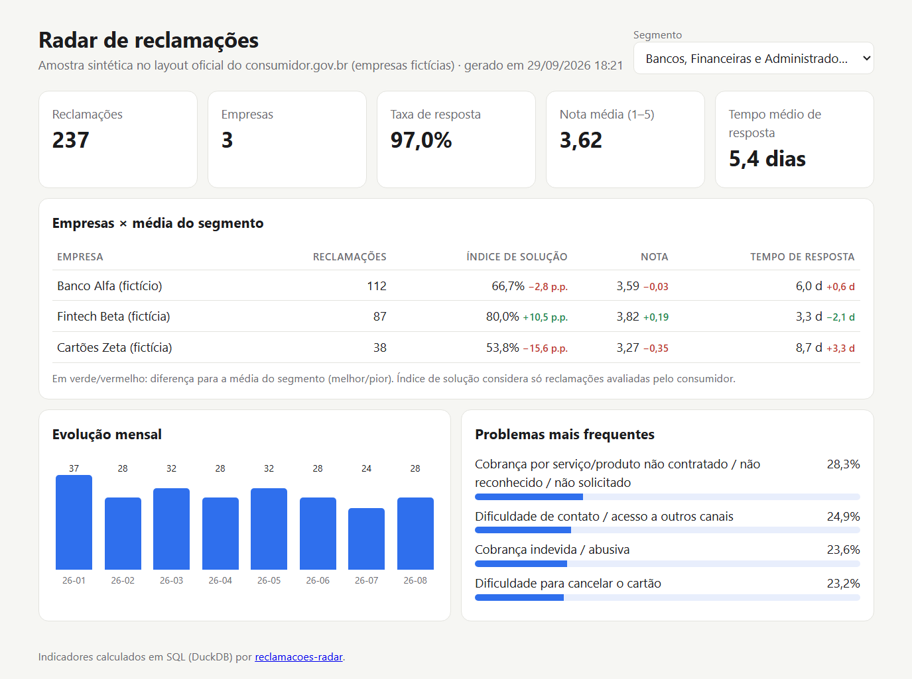

# reclamacoes-radar

[](https://github.com/arthurpenedo/reclamacoes-radar/actions/workflows/ci.yml)
[](https://arthurpenedo.github.io/reclamacoes-radar/)


> Pipeline de dados abertos do **consumidor.gov.br**: ingestão → **DuckDB** → indicadores em **SQL** (índice de solução, taxa de resposta, nota, tempo de resposta) → relatório, com um **resumo executivo gerado por IA** que não pode inventar números.

## O problema

O consumidor.gov.br publica mensalmente milhões de reclamações em dados abertos. Times de CX e ouvidoria querem respostas simples: *como estamos em relação à concorrência? Quais problemas mais geram reclamação? Estamos melhorando?* Os arquivos, porém, são CSVs grandes, com colunas acentuadas, separador `;` e codificações variadas.

O `reclamacoes-radar` resolve o caminho inteiro:

1. **Ingestão robusta:** normaliza os nomes das colunas oficiais, converte datas e tipos e valida o esquema.
2. **Indicadores em SQL puro no DuckDB,** analítico e rápido, sem servidor.
3. **Relatório em Markdown** por segmento de mercado.
4. **Dashboard HTML** com cada empresa comparada à média do próprio segmento.
5. **Resumo executivo com Claude,** com uma verificação que **rejeita qualquer número citado que não esteja nos dados**.

## Demo (amostra sintética)

**Dashboard ao vivo:** [arthurpenedo.github.io/reclamacoes-radar](https://arthurpenedo.github.io/reclamacoes-radar/) (gerado pelo CI a cada push; o segmento escolhido fica na URL, ex.: [`#s0`](https://arthurpenedo.github.io/reclamacoes-radar/#s0)).



```text
$ reclamacoes-radar carregar data/amostra_sintetica.csv --db radar.duckdb
600 reclamações na base radar.duckdb

$ reclamacoes-radar relatorio --db radar.duckdb --segmento "Bancos, Financeiras e Administradoras de Cartão"
```

| empresa | reclamacoes | taxa_resposta | indice_solucao | nota_media | tempo_medio_dias |
|---|---|---|---|---|---|
| Banco Alfa (fictício) | 112 | 99.1 | 66.7 | 3.59 | 6.0 |
| Fintech Beta (fictícia) | 87 | 96.6 | 80.0 | 3.82 | 3.3 |
| Cartões Zeta (fictícia) | 38 | 92.1 | 53.8 | 3.27 | 8.7 |

| problema | reclamacoes | percentual |
|---|---|---|
| Cobrança por serviço/produto não contratado / não reconhecido | 67 | 28.3 |
| Dificuldade de contato / acesso a outros canais | 59 | 24.9 |
| Cobrança indevida / abusiva | 56 | 23.6 |

```text
$ reclamacoes-radar dashboard --db radar.duckdb --saida dashboard.html
```

Um único arquivo HTML, sem servidor e sem dependências, com modo escuro e layout para celular. Na visão por segmento, cada empresa aparece contra a média do segmento: índice de solução em pontos percentuais, nota e tempo de resposta. Verde é melhor que a média e vermelho, pior (tempo menor conta como melhor).

> As empresas da amostra são **fictícias**. A amostra tem o mesmo layout do arquivo oficial e é gerada por `data/gerar_amostra.py`.

## Com o Claude de verdade: a trava de números funcionou

O resumo executivo rodou de verdade (30/09/2026, `claude-opus-5-5`, amostra sintética). **Na primeira execução, a checagem de números barrou o resumo**: ele citava "177", que não existe nos indicadores. Era a soma de duas categorias de cobrança (110 + 67), um número calculado pelo modelo, o que o prompt proíbe. Sem a checagem, esse número iria para a diretoria.

Duas correções saíram disso: o prompt agora proíbe somar ou agrupar categorias, e o erro (`NumerosInventados`) guarda o resumo rejeitado para auditoria. Na segunda execução, o resumo passou — completo em [`docs/exemplo-resumo.json`](docs/exemplo-resumo.json):

> - Cobrança indevida / abusiva é o principal problema: 110 reclamações (18,3%). Em seguida vêm dificuldade / atraso no cancelamento, com 69 (11,5%), e cobrança por serviço/produto não contratado, com 67 (11,2%).
> - A taxa de resposta geral é alta (96,2%), mas não garante solução. [...]
> - **Recomendação:** priorizar Telecom Gama e Cartões Zeta na redução do tempo de resposta e na melhora da solução, usando como referência as práticas da Fintech Beta e da Loja Delta (índices de solução de 80,0 e 82,7).

Custo medido: **US$ 0,016 por resumo** (≈ 1.400 tokens de entrada, 500 de saída).

## Arquitetura

```
CSV oficial (;)  ──► ingest.py ──► DuckDB: tabela `reclamacoes` (tipada)
                                          │
                     indicators.py (SQL) ◄┘ ──► report.py ──► Markdown
                                          ├──► dashboard.py ──► HTML (GitHub Pages)
                                          │
                                          └──► insights.py ──► Claude ──► check_numbers() ──► resumo executivo
```

### Decisões técnicas

- **DuckDB em vez de pandas para as agregações.** Os arquivos mensais oficiais têm centenas de milhares de linhas. O DuckDB lê CSV direto, roda SQL analítico em colunas e cabe num único arquivo `.duckdb`.
- **Definições explícitas dos indicadores.** O índice de solução considera só reclamações **avaliadas** pelo consumidor, como nos boletins oficiais. Empresas com menos de 5 reclamações ficam fora dos rankings.
- **A IA só redige; o SQL calcula.** O modelo recebe os indicadores prontos, e `check_numbers` barra resumos com números que não estão na entrada.

## Como rodar

```bash
git clone https://github.com/arthurpenedo/reclamacoes-radar && cd reclamacoes-radar
pip install -e ".[dev]"

reclamacoes-radar carregar data/amostra_sintetica.csv --db radar.duckdb
reclamacoes-radar relatorio --db radar.duckdb
reclamacoes-radar dashboard --db radar.duckdb --saida dashboard.html
reclamacoes-radar resumo --db radar.duckdb        # precisa de ANTHROPIC_API_KEY
pytest -q
```

### Com dados reais

Baixe os arquivos mensais em **dados.gov.br**, no conjunto "Reclamações do consumidor.gov.br" (ou na seção de dados abertos do consumidor.gov.br), e carregue quantos meses quiser. A tabela acumula:

```bash
reclamacoes-radar carregar data/raw/2026-07.csv --db radar.duckdb --encoding latin-1
reclamacoes-radar carregar data/raw/2026-08.csv --db radar.duckdb --encoding latin-1
```

## Próximos passos

- [ ] Download automático dos meses pela API do dados.gov.br
- [x] Dashboard HTML com filtro por segmento, publicado no GitHub Pages
- [x] Comparativo empresa × média do segmento
- [ ] Classificação de temas emergentes com LLM em lote (Batches API)

---

Feito por [Arthur Penedo](https://github.com/arthurpenedo) · [LinkedIn](https://www.linkedin.com/in/arthuralves-penedo)
